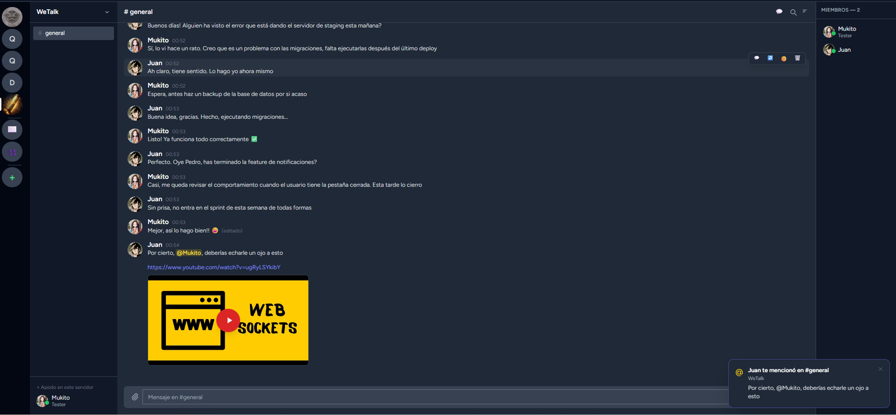
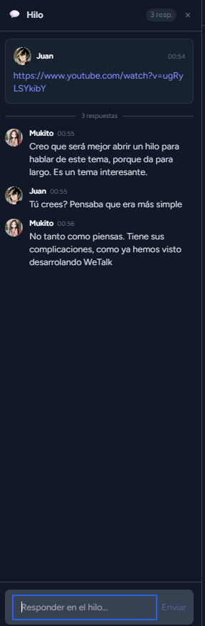

# MyTalk

Aplicación de chat en tiempo real inspirada en Discord. Construida con **Laravel 12**, **React 18** e **Inertia.js**, con WebSockets propios via Laravel Reverb.

---



---

## Características

### Servidores y canales
- Crear servidores y unirse mediante enlace de invitación
- Canales de **texto** y de **anuncios** (solo admins pueden publicar)
- **Categorías** para organizar canales
- **Permisos por rol y canal** (ver / escribir) — lógica compatible con Discord
- Reordenamiento de canales por **drag & drop**
- Icono y nombre de servidor personalizables

### Mensajes
- Envío en tiempo real vía WebSocket
- **Adjuntos**: imágenes, vídeos (con miniatura) y archivos genéricos (hasta 20 MB)
- **Respuestas** a mensajes concretos
- **Edición** con historial de versiones anteriores
- **Eliminación** (propia o por moderadores)
- **Reacciones** emoji
- **Mensajes fijados** con panel lateral
- Carga de historial paginada (scroll infinito hacia arriba)
- Agrupación visual de mensajes consecutivos del mismo usuario

### Formato de texto
- Markdown básico: **negrita**, *cursiva*, ~~tachado~~
- Código inline y **bloques de código** con syntax highlighting (14 lenguajes)
- **Vista previa de enlaces** (Open Graph)
- **Embeds de YouTube** con miniatura y reproductor inline

| Bloques de código | YouTube embed |
|:-:|:-:|
|  |  |

### Hilos
- Crear un hilo desde cualquier mensaje del canal
- Panel lateral con el mensaje original + respuestas en tiempo real
- **Título editable** por cualquier miembro
- Panel de **lista de hilos** del canal ordenado por actividad



### Menciones y notificaciones
- Autocompletado `@usuario` con sugerencias
- Badges de menciones no leídas por canal y servidor
- **Notificaciones push** (Web Push / VAPID) — funcionan con la pestaña cerrada
- Notificaciones nativas del navegador y toasts in-app

### Mensajes directos y amigos
- Conversaciones **1:1** y **grupos** de DM
- Sistema de **solicitudes de amistad**


### Roles y moderación
- Roles personalizados por servidor con color
- Permisos granulares: gestionar canales, mensajes, roles, expulsar, banear
- **Expulsión** y **baneo** de miembros (con razón opcional)
- Lista de baneados con opción de desbanear


### Perfil y presencia
- Avatar, banner de color y bio
- **Estado**: en línea, ausente, no molestar
- **Estado personalizado** (texto libre)
- **Apodo** por servidor
- Indicador de presencia en tiempo real para todos los miembros del servidor

### UX
- Indicador **"X está escribiendo..."**
- Búsqueda de mensajes en el canal activo
- **Búsqueda global** (`Ctrl+K`) en todos los servidores
- Scroll-to-bottom con contador de mensajes nuevos
- Diseño responsive con sidebar móvil

---

## Stack tecnológico

| Capa | Tecnologías |
|------|-------------|
| **Backend** | PHP 8.2, Laravel 12, Laravel Reverb, Inertia.js, minishlink/web-push |
| **Frontend** | React 18, Tailwind CSS, Laravel Echo, highlight.js |
| **Base de datos** | SQLite (dev) / MySQL (prod) |
| **Tooling** | Vite 7, Concurrently, Laravel Pint, PHPUnit |

---

## Instalación

### Requisitos

- PHP 8.2+
- Composer 2.x
- Node.js 18+ y npm 9+

### Pasos

```bash
# 1. Clonar el repositorio
git clone https://github.com/tu-usuario/mytalk.git
cd mytalk

# 2. Instalar dependencias, configurar .env y migrar la base de datos
composer run setup

# 3. Instalar dependencias frontend y compilar assets
npm install && npm run build
```

El script `composer run setup` equivale a:

```bash
composer install
cp .env.example .env
php artisan key:generate
php artisan migrate
```

---

## Arrancar en desarrollo

```bash
# Terminal 1 — servidor, colas, Vite y logs en paralelo
composer run dev

# Terminal 2 — servidor WebSocket
php artisan reverb:start
```

La aplicación estará disponible en **http://localhost:8000**.

---

## Configuración

Edita el archivo `.env` generado. Las variables más relevantes:

```dotenv
# Nombre de la app
APP_NAME="MyTalk"

# Reverb (tiempo real)
BROADCAST_CONNECTION=reverb
REVERB_APP_KEY=clave-secreta
REVERB_APP_SECRET=secreto-muy-seguro

# Colas (necesarias para broadcasting)
QUEUE_CONNECTION=database

# Web Push (notificaciones push — opcional)
VAPID_SUBJECT=mailto:admin@tudominio.com
VAPID_PUBLIC_KEY=...
VAPID_PRIVATE_KEY=...
```

Consulta [`docs/ADMIN.md`](docs/ADMIN.md) para instrucciones detalladas de despliegue en producción y generación de claves VAPID.

---

## Documentación

| Documento | Descripción |
|-----------|-------------|
| [`docs/USUARIO.md`](docs/USUARIO.md) | Guía de uso para usuarios finales |
| [`docs/ADMIN.md`](docs/ADMIN.md) | Instalación, despliegue y administración |
| [`docs/TECNOLOGIAS.md`](docs/TECNOLOGIAS.md) | Stack técnico y arquitectura |

---

## Autor

Desarrollado por **Pedro Jiménez Luján**.

## Licencia

Este proyecto es de código abierto y está disponible bajo la licencia **MIT**. Puedes usarlo, modificarlo y distribuirlo libremente, incluso con fines comerciales, siempre que se mantenga el aviso de copyright original.
