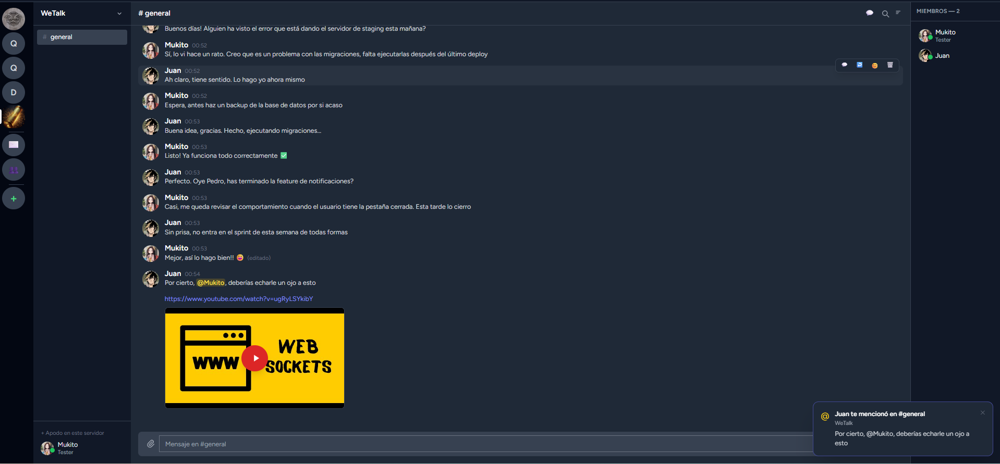
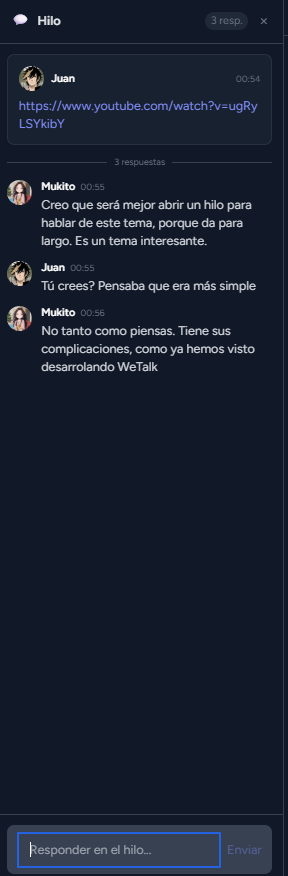

# MyTalk

**Self-hosted realtime chat** — servidores, canales, hilos, DMs y voz. Inspirado en Discord, **no es un “Discord killer”**: es un proyecto de portfolio y aprendizaje con stack propio (Laravel + Reverb + Inertia + Tauri).

**Demo en vivo:** [https://mytalk.pjimenezpf.com](https://mytalk.pjimenezpf.com)



---

## Portfolio (ES)

### Qué es

MyTalk es un chat en tiempo real **autohospedado**: tú controlas el servidor, la base de datos y Reverb. Pensado para equipos pequeños o demos, con mensajes en vivo, hilos, menciones, push opcional y app de escritorio Windows.

### Stack

| Capa | Tecnologías |
|------|-------------|
| Backend | PHP 8.2, Laravel 12, Laravel Reverb, Inertia.js |
| Frontend | React 18, Tailwind CSS, Laravel Echo |
| Escritorio | Tauri 2 (Windows), actualizaciones firmadas |
| Base de datos | SQLite (dev) / MySQL (prod) |

### Capturas de diseño

Galería del rediseño **Papel UI**: [`docs/design-preview/`](docs/design-preview/) (light/dark). Regenerar con `node scripts/capture-design-preview.mjs` tras levantar la app.

### Demo en ~2 minutos (local)

1. **Instalar y migrar** — ver [Instalación](#instalación) abajo.
2. **Datos de demo:** `php artisan db:seed --class=DemoSeeder`
3. **Arrancar:** `composer run dev` + `php artisan reverb:start`
4. **Login:** `test@example.com` / `password`
5. **Recorrido:** landing `/` → canal **#general** (servidor *Estudio Papel*) → abrir un **hilo** → canal **#sala-voz** → mencionar la **app Tauri** (notificaciones nativas)

### Voz — límites honestos

WebRTC **full mesh**, solo **STUN**, sin SFU. Recomendado **2–4 personas**; NAT estricto puede impedir audio entre pares. Detalle: [`docs/VOZ.md`](docs/VOZ.md).

### Seguridad Tauri

La clave **privada** del updater (`mytalk.key`) **no debe estar en el repo**. Si alguna vez se commitió, **rótala** y guarda la nueva solo en `~/.tauri/` (o fuera del árbol git). En el repo solo corresponde la pública (`src-tauri/mytalk.key.pub`).

---

## Portfolio (EN)

### What it is

MyTalk is a **self-hosted realtime chat**: servers, text/voice channels, threads, DMs, and optional push. It is **not trying to replace Discord** — it is a portfolio/learning project with an owned stack (Laravel + Reverb + Inertia + Tauri).

### Live demo

[https://mytalk.pjimenezpf.com](https://mytalk.pjimenezpf.com)

### Design previews

See [`docs/design-preview/`](docs/design-preview/) for Papel UI screenshots (light/dark).

### ~2-minute local demo path

1. Install & migrate (see [Installation](#installation) below).
2. Seed showcase data: `php artisan db:seed --class=DemoSeeder`
3. Run `composer run dev` and `php artisan reverb:start`
4. Log in as `test@example.com` / `password`
5. Walk through: landing → **#general** chat → **thread** → **#sala-voz** voice → mention **Tauri desktop** app

### Voice caveats

STUN-only, full-mesh WebRTC, **2–4 participants** recommended; strict NAT may break peer audio. Details: [`docs/VOZ.md`](docs/VOZ.md).

### Tauri signing keys

Never commit the updater **private** key. If it was ever in git history, **rotate** it and keep the new key outside the repository (e.g. `~/.tauri/`).

---

## Características

### Servidores y canales
- Crear servidores y unirse mediante enlace de invitación
- Canales de **texto**, **anuncios** (solo admins pueden publicar) y **voz**
- **Categorías** para organizar canales
- **Permisos por rol y canal** (ver / escribir) — lógica compatible con Discord
- Reordenamiento de canales por **drag & drop**
- Icono y nombre de servidor personalizables

### Mensajes
- Envío en tiempo real vía WebSocket
- **Adjuntos**: imágenes, vídeos (con miniatura) y archivos genéricos (hasta 20 MB)
- **Respuestas** a mensajes concretos
- **Edición** con historial de versiones anteriores
- **Eliminación** (propia o por moderadores)
- **Reacciones** emoji
- **Mensajes fijados** con panel lateral
- Carga de historial paginada (scroll infinito hacia arriba)
- Agrupación visual de mensajes consecutivos del mismo usuario

### Formato de texto
- Markdown básico: **negrita**, *cursiva*, ~~tachado~~
- Código inline y **bloques de código** con syntax highlighting (14 lenguajes)
- **Vista previa de enlaces** (Open Graph)
- **Embeds de YouTube** con miniatura y reproductor inline

| Bloques de código | YouTube embed |
|:-:|:-:|
|  |  |

### Hilos
- Crear un hilo desde cualquier mensaje del canal
- Panel lateral con el mensaje original + respuestas en tiempo real
- **Título editable** por cualquier miembro
- Panel de **lista de hilos** del canal ordenado por actividad



### Menciones y notificaciones
- Autocompletado `@usuario` con sugerencias
- Badges de menciones no leídas por canal y servidor
- **Notificaciones push** (Web Push / VAPID) — funcionan con la pestaña cerrada
- **Notificaciones nativas del SO** en la app de escritorio (sin permisos de navegador)
- Notificaciones nativas del navegador y toasts in-app

### Mensajes directos y amigos
- Conversaciones **1:1** y **grupos** de DM
- Sistema de **solicitudes de amistad**


### Canales de voz
- Llamadas de audio P2P en tiempo real via **WebRTC** (malla full mesh)
- Silenciar micrófono, ensordecerse y control de volumen por usuario
- **Llamadas persistentes**: navega entre canales de texto sin colgar
- **Compartir pantalla** con `getDisplayMedia`
- Ver [`docs/VOZ.md`](docs/VOZ.md) para límites de NAT y tamaño de grupo

### App de escritorio (Windows)
- Aplicación nativa para Windows construida con **Tauri 2**
- Barra de título personalizada integrada con controles de ventana
- **Actualizaciones automáticas** firmadas
- Notificaciones nativas del sistema operativo

### Administración
- Panel `/admin` accesible solo para superadmins
- Envío de mensajes **broadcast** a todos los usuarios
- Estadísticas básicas de la plataforma

---

## Stack tecnológico

| Capa | Tecnologías |
|------|-------------|
| **Backend** | PHP 8.2, Laravel 12, Laravel Reverb, Inertia.js, minishlink/web-push |
| **Frontend** | React 18, Tailwind CSS, Laravel Echo, highlight.js |
| **Base de datos** | SQLite (dev) / MySQL (prod) |
| **Escritorio** | Tauri 2 (Windows), tauri-plugin-updater, tauri-plugin-notification |
| **Tooling** | Vite 7, Concurrently, Laravel Pint, PHPUnit |

---

## Instalación

### Requisitos

- PHP 8.2+
- Composer 2.x
- Node.js 18+ y npm 9+

### Pasos

```bash
git clone https://github.com/BanMePlox/MyTalk.git
cd MyTalk

composer run setup
npm install && npm run build
```

El script `composer run setup` equivale a:

```bash
composer install
cp .env.example .env
php artisan key:generate
php artisan migrate
```

### Datos de demostración

Tras migrar, carga el servidor *Estudio Papel* con mensajes, hilo, encuesta y canal de voz:

```bash
php artisan db:seed --class=DemoSeeder
```

Credenciales: `test@example.com` / `password`

Para empezar de cero:

```bash
php artisan migrate:fresh --seed --seeder=DemoSeeder
```

---

## Installation

Same steps as above. After migrate:

```bash
php artisan db:seed --class=DemoSeeder
```

Login: `test@example.com` / `password`

---

## Arrancar en desarrollo

```bash
# Terminal 1 — servidor, colas, Vite y logs en paralelo
composer run dev

# Terminal 2 — servidor WebSocket
php artisan reverb:start
```

La aplicación estará disponible en **http://localhost:8000**.

---

## Configuración

Copia `.env.example` a `.env`. Variables clave: `APP_NAME=MyTalk`, `BROADCAST_CONNECTION=reverb`, bloque `REVERB_*`, `VITE_REVERB_*` y VAPID/OAuth opcionales — ver comentarios en [`.env.example`](.env.example).

Consulta [`docs/ADMIN.md`](docs/ADMIN.md) para despliegue en producción y generación de claves VAPID.

---

## Documentación

| Documento | Descripción |
|-----------|-------------|
| [`docs/USUARIO.md`](docs/USUARIO.md) | Guía de uso para usuarios finales |
| [`docs/ADMIN.md`](docs/ADMIN.md) | Instalación, despliegue y administración |
| [`docs/TECNOLOGIAS.md`](docs/TECNOLOGIAS.md) | Stack técnico y arquitectura |
| [`docs/VOZ.md`](docs/VOZ.md) | Límites de voz WebRTC (STUN, mesh, NAT) |
| [`docs/design-preview/`](docs/design-preview/) | Capturas Papel UI (portfolio) |

---

## Autor

Desarrollado por **Pedro Jiménez Luján**.

## Licencia

MIT — ver aviso de copyright en el repositorio.
